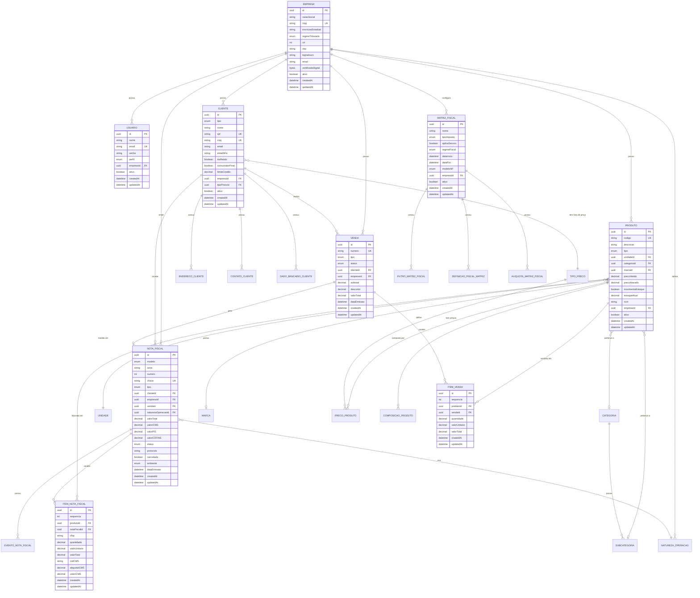
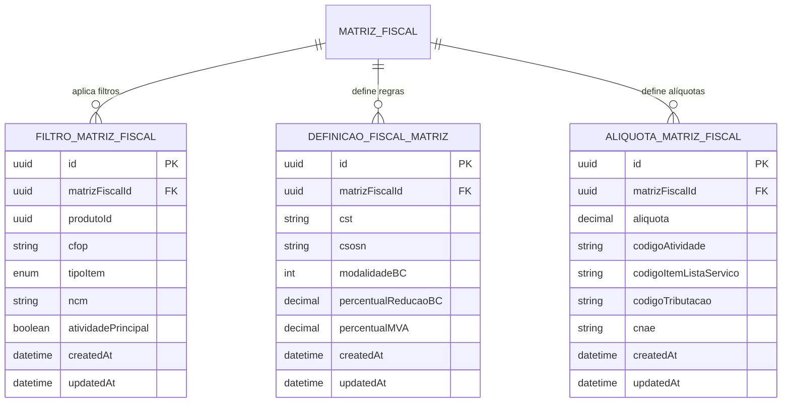
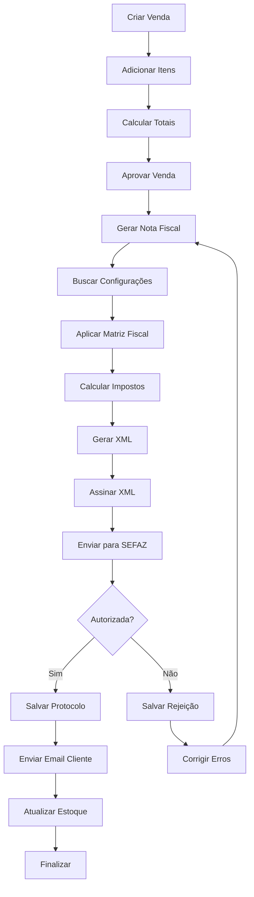
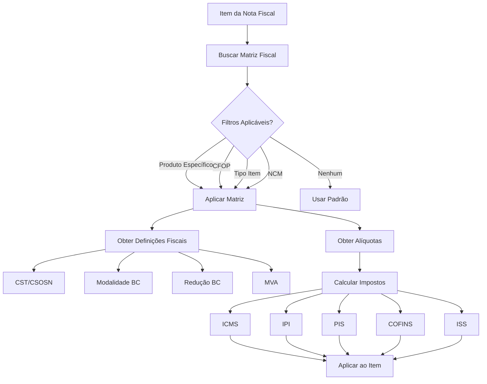

# Diagrama Entidade-Relacionamento - Sistema de Nota Fiscal

## Diagrama Principal



## Diagrama de Configurações Fiscais

```mermaid
erDiagram
    EMPRESA ||--o| CONFIGURACAO_NFE : configura
    EMPRESA ||--o| CONFIGURACAO_NFCE : configura
    EMPRESA ||--o| CONFIGURACAO_NFSE : configura
    
    CONFIGURACAO_NFE {
        uuid id PK
        uuid empresaId FK UK
        string serie
        int proximoNumero
        enum ambiente
        bytes certificadoDigital
        enum formatoImpressao
        boolean ativo
        datetime createdAt
        datetime updatedAt
    }
    
    CONFIGURACAO_NFCE {
        uuid id PK
        uuid empresaId FK UK
        string serie
        int proximoNumero
        enum ambiente
        string idToken
        string csc
        boolean ativo
        datetime createdAt
        datetime updatedAt
    }
    
    CONFIGURACAO_NFSE {
        uuid id PK
        uuid empresaId FK UK
        string serie
        int proximoNumero
        enum ambiente
        string provedor
        string usuario
        string senha
        boolean ativo
        datetime createdAt
        datetime updatedAt
    }
```

## Diagrama de Matriz Fiscal Detalhado



## Fluxo de Dados - Emissão de NF-e



## Fluxo de Aplicação da Matriz Fiscal



## Relacionamentos Principais

### 1. Empresa (Multi-tenant)
- Centro do sistema
- Todas as entidades principais se relacionam com Empresa
- Permite múltiplas empresas no mesmo banco

### 2. Cliente
- Pode ser Pessoa Física ou Jurídica
- Possui múltiplos endereços, contatos e dados bancários
- Relacionado com vendas e notas fiscais

### 3. Produto
- Estrutura hierárquica: Categoria > Subcategoria
- Suporta composição (kits)
- Múltiplos preços por tipo de cliente
- Controle de estoque

### 4. Venda → Nota Fiscal
- Relacionamento 1:1
- Venda gera uma nota fiscal
- Nota fiscal referencia a venda original

### 5. Matriz Fiscal
- Sistema flexível de tributação
- Filtros para aplicação condicional
- Definições fiscais por imposto
- Alíquotas configuráveis

## Índices Importantes

```sql
-- Índices de performance
CREATE INDEX idx_cliente_cnpj ON clientes(cnpj);
CREATE INDEX idx_cliente_cpf ON clientes(cpf);
CREATE INDEX idx_produto_codigo ON produtos(codigo);
CREATE INDEX idx_nota_fiscal_chave ON notas_fiscais(chave);
CREATE INDEX idx_nota_fiscal_data ON notas_fiscais(data_emissao);
CREATE INDEX idx_venda_data ON vendas(data_emissao);
CREATE INDEX idx_venda_status ON vendas(status);

-- Índices compostos
CREATE INDEX idx_cliente_empresa ON clientes(empresa_id, ativo);
CREATE INDEX idx_produto_empresa ON produtos(empresa_id, ativo);
CREATE INDEX idx_nota_fiscal_empresa_status ON notas_fiscais(empresa_id, status);
```

## Observações sobre o Modelo

1. **UUID como Chave Primária**: Maior segurança e facilita distribuição
2. **Soft Delete**: Campo `ativo` para não perder histórico
3. **Timestamps**: `createdAt` e `updatedAt` automáticos
4. **Decimal para Valores**: Precisão em cálculos financeiros
5. **Enums**: Validação de dados no banco
6. **Relacionamentos em Cascata**: Exclusão de itens ao excluir pai
7. **Índices Únicos**: Garantem integridade (CNPJ, CPF, chave NF-e)

